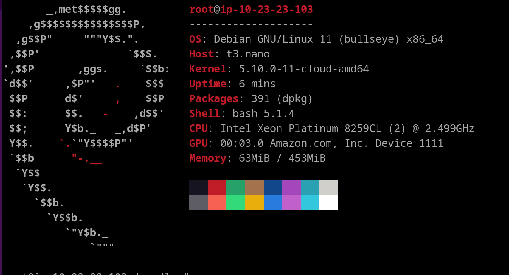
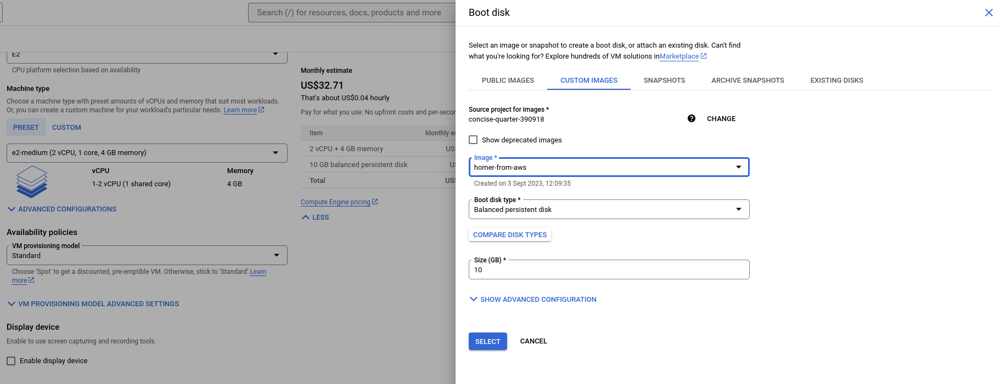
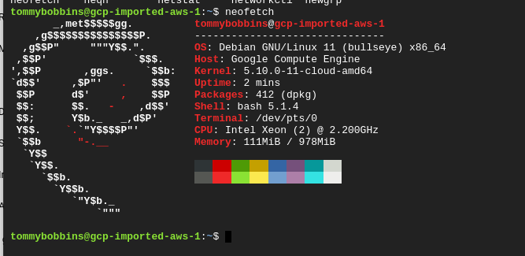

# super-duper-doodle
Worked example for migrating AWS AMIs to GCP . 
Amazon Linux imports are not supported by GCP!


When run using encrpyed AMIs, it would return the following, so this is only being used for unencrypted AMIs:
```
An error occurred (InvalidParameter) when calling the ExportImage operation: The image ID (ami-<id>) provided has encrypted EBS block devices and is not exportable.
```

# AWS Debian instance

## Output of the neofetch after EC2 creation in AWS



```
       _,met$$$$$gg.          root@ip-10-23-23-103 
    ,g$$$$$$$$$$$$$$$P.       -------------------- 
  ,g$$P"     """Y$$.".        OS: Debian GNU/Linux 11 (bullseye) x86_64 
 ,$$P'              `$$$.     Host: t3.nano 
',$$P       ,ggs.     `$$b:   Kernel: 5.10.0-11-cloud-amd64 
`d$$'     ,$P"'   .    $$$    Uptime: 6 mins 
 $$P      d$'     ,    $$P    Packages: 391 (dpkg) 
 $$:      $$.   -    ,d$$'    Shell: bash 5.1.4 
 $$;      Y$b._   _,d$P'      CPU: Intel Xeon Platinum 8259CL (2) @ 2.499GHz 
 Y$$.    `.`"Y$$$$P"'         GPU: 00:03.0 Amazon.com, Inc. Device 1111 
 `$$b      "-.__              Memory: 63MiB / 453MiB 
  `Y$$
   `Y$$.                                              
     `$$b.                                            
       `Y$$b.
          `"Y$b._
              `"""

```


https://repost.aws/knowledge-center/create-unencrypted-volume-kms-key

# Building a decrypted volume from an encrypted one.

Create a swing box as described in the steps above and attach the encrypted disk and an identically sized (or bigger) disk. In this case, the encrypted disk is /dev/sdf
and the unencrypted raw disk is /dev/sdg.
```
[root@ip-10-23-23-239 ~]# ls -l /dev/sdf
lrwxrwxrwx. 1 root root 7 Sep  2 15:52 /dev/sdf -> nvme1n1
[root@ip-10-23-23-239 ~]# ls -l /dev/sdg
lrwxrwxrwx. 1 root root 7 Sep  2 15:52 /dev/sdg -> nvme2n1
[root@ip-10-23-23-239 ~]# lsblk /dev/sdf
NAME          MAJ:MIN RM SIZE RO TYPE MOUNTPOINTS
nvme1n1       259:4    0  20G  0 disk
├─nvme1n1p1   259:5    0  20G  0 part
└─nvme1n1p128 259:6    0   1M  0 part
[root@ip-10-23-23-239 ~]# lsblk /dev/sdg
NAME    MAJ:MIN RM SIZE RO TYPE MOUNTPOINTS
nvme2n1 259:7    0  20G  0 disk
[root@ip-10-23-23-239 ~]# fdisk -l /dev/sdf
Disk /dev/sdf: 20 GiB, 21474836480 bytes, 41943040 sectors
Disk model: Amazon Elastic Block Store
Units: sectors of 1 * 512 = 512 bytes
Sector size (logical/physical): 512 bytes / 512 bytes
I/O size (minimum/optimal): 4096 bytes / 4096 bytes
Disklabel type: gpt
Disk identifier: FCDB441D-BAE2-4B25-8D0C-2A641CE98E80

Device      Start      End  Sectors Size Type
/dev/sdf1    4096 41943006 41938911  20G Linux filesystem
/dev/sdf128  2048     4095     2048   1M BIOS boot

Partition table entries are not in disk order.
[root@ip-10-23-23-239 ~]# fdisk -l /dev/sdg
Disk /dev/sdg: 20 GiB, 21474836480 bytes, 41943040 sectors
Disk model: Amazon Elastic Block Store
Units: sectors of 1 * 512 = 512 bytes
Sector size (logical/physical): 512 bytes / 512 bytes
I/O size (minimum/optimal): 4096 bytes / 4096 bytes
[root@ip-10-23-23-239 ~]# dd if=/dev/sdf of=/dev/sdg bs=4096k status=progress
[root@ip-10-23-23-239 ~]# dd if=/dev/sdf of=/dev/sdg bs=4096k status=progress
21361590272 bytes (21 GB, 20 GiB) copied, 163 s, 131 MB/s
5120+0 records in
5120+0 records out
21474836480 bytes (21 GB, 20 GiB) copied, 164.007 s, 131 MB/s
```

# Running the export

```
$ aws ec2 export-image --image-id ami-0257e67a2027d9bc5 --disk-image-format VHD --s3-export-location S3Bucket=super-duper-doodle20230902122013511700000001,S3Prefix=exports/ --region eu-west-2
{
    "DiskImageFormat": "VHD",
    "ExportImageTaskId": "export-ami-07b027f4b1a649986",
    "ImageId": "ami-0257e67a2027d9bc5",
    "Progress": "0",
    "S3ExportLocation": {
        "S3Bucket": "super-duper-doodle20230902122013511700000001",
        "S3Prefix": "exports/"
    },
    "Status": "active",
    "StatusMessage": "validating"
}

$ aws ec2 describe-export-image-tasks --export-image-task-ids export-ami-07b027f4b1a649986 --region=eu-west-2
{
    "ExportImageTasks": [
        {
            "ExportImageTaskId": "export-ami-07b027f4b1a649986",
            "Progress": "85",
            "S3ExportLocation": {
                "S3Bucket": "super-duper-doodle20230902122013511700000001",
                "S3Prefix": "exports/"
            },
            "Status": "active",
            "StatusMessage": "converting",
            "Tags": []
        }
    ]
}


```
# After 15 minutes
```
$ aws ec2 describe-export-image-tasks --export-image-task-ids export-ami-07b027f4b1a649986 --region=eu-west-2
{
    "ExportImageTasks": [
        {
            "ExportImageTaskId": "export-ami-07b027f4b1a649986",
            "S3ExportLocation": {
                "S3Bucket": "super-duper-doodle20230902122013511700000001",
                "S3Prefix": "exports/"
            },
            "Status": "completed",
            "Tags": []
        }
    ]
}
```
# Check the credentials work and can list the AMI
```
$ export AWS_ACCESS_KEY_ID="value taken from secret or from terraform.tfstate file"
$ export AWS_SECRET_ACCESS_KEY="value taken from secret or from terraform.tfstate file"
$ aws s3 ls s3://super-duper-doodle20230902122013511700000001/exports/
2023-09-02 17:47:54 21475927040 export-ami-07b027f4b1a649986.vhd
```


# Import

```
$ aws sts get-session-token --duration-seconds 3600
{
    "Credentials": {
        "AccessKeyId": "Access key stuff",
        "SecretAccessKey": "Secret stuff",
        "SessionToken": "Session stuff",
        "Expiration": "2023-09-02T18:08:59+00:00"
    }
}


## Switch to the session token credentials from the above

```
$ export AWS_ACCESS_KEY_ID="Access key stuff"
$ export AWS_SECRET_ACCESS_KEY="Secret stuff"
$ export AWS_SESSION_TOKEN="Session stuff"
$ aws s3 ls s3://super-duper-doodle20230903081041864300000001/exports/
2023-09-03 10:31:55 1636196352 export-ami-021a37cd1e7f3d240.vhd
$ export S3_BUCKET_LOCATION="s3://super-duper-doodle20230903081041864300000001/exports/export-ami-021a37cd1e7f3d240.vhd"
$ gcloud beta compute images import debian-11-test-image --aws-access-key-id="$AWS_ACCESS_KEY_ID" --aws-region=eu-west-2 --aws-secret-access-key="$AWS_SECRET_ACCESS_KEY" --aws-session-token="$AWS_SESSION_TOKEN" --aws-source-ami-file-path="$S3_BUCKET_LOCATION"
WARNING: Importing image. This may take up to 2 hours.
The "cloudbuild.googleapis.com" service is not enabled for this project. It is required for this operation.

Would you like to enable this service? (Y/n)?  y

Enabling service [cloudbuild.googleapis.com] on project [bobbly-bubbly-123456]...
Operation "operations/acf.p2-1234567889-" finished successfully.
The following IAM permissions are needed for this operation:
[roles/compute.admin serviceAccount:1234567890@cloudbuild.gserviceaccount.com
roles/iam.serviceAccountTokenCreator serviceAccount:1234567890@cloudbuild.gserviceaccount.com
roles/iam.serviceAccountUser serviceAccount:1234567890@cloudbuild.gserviceaccount.com]

Would you like to add the permissions (Y/n)?  y

starting build "1234567-0953-4f4c-a5a1-92483483cabe"
[onestep-import-image-aws] 2023/09/02 18:46:05 Starting to copy ...
[onestep-import-image-aws] 2023/09/02 18:46:05 Copying s3://super-duper-doodle20230902122013511700000001/exports/export-ami-07b027f4b1a649986.vhd to gs://bibbly-bobbly-123456-daisy-bkt/onestep-image-import-aws-gnx36.vmdk.
[onestep-import-image-aws] 2023/09/02 18:46:10 Total written size: 95 MiB of 20 GiB.
[onestep-import-image-aws] 2023/09/02 18:46:14 Total written size: 191 MiB of 20 GiB.
[onestep-import-image-aws] 2023/09/02 18:56:49 Successfully copied to gs://bibbly-bobbly-123456-daisy-bkt/onestep-image-import-aws-gnx36.vmdk in 10m43.80993304s.
[onestep-import-image-aws] 2023/09/02 18:56:49 Starting to import image ...
[import-image]: 2023-09-02T18:56:50Z Inspecting the image file...
[import-image]: 2023-09-02T18:57:59Z Creating Google Compute Engine disk from gs://bibbly-bobbly-123456-daisy-bkt/onestep-image-import-aws-gnx36.vmdk
[import-image]: 2023-09-03T11:05:02Z Inspection result=os_release:{cli_formatted:"debian-11"  distro:"debian"  major_version:"11"  minor_version:"2"  architecture:X64  distro_id:DEBIAN}  bios_bootable:true  uefi_bootable:true  elapsed_time_ms:76617  os_count:1
[import-image]: 2023-09-03T11:05:02Z The boot disk can boot with either BIOS or a UEFI bootloader. The default setting for booting is BIOS. If you want to boot using UEFI, please see https://cloud.google.com/compute/docs/import/importing-virtual-disks#importing_a_virtual_disk_with_uefi_bootloader'.
[import-image]: 2023-09-03T11:05:19Z Making disk bootable on Google Compute Engine
[import-image]: 2023-09-03T11:10:59Z Finished making disk bootable
[onestep-import-image-aws] 2023/09/03 11:11:00 Image import from AWS finished successfully!
[onestep-import-image-aws] 2023/09/03 11:11:00 Cleaning up ...
[onestep-import-image-aws] 2023/09/03 11:11:00 Deleting content of: gs://bibbly-bobbly-123456-daisy-bkt/onestep-image-import-aws-lt1jl.vmdk
[onestep-import-image-aws]: 2023-09-03T11:11:00Z Deleting gs://bibbly-bobbly-123456-daisy-bkt/onestep-image-import-aws-lt1jl.vmdk

``` 
# Start instance in GCP



Check that this is the same image as we previously installed neofetch: 

